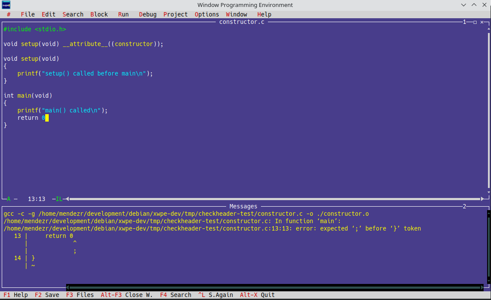
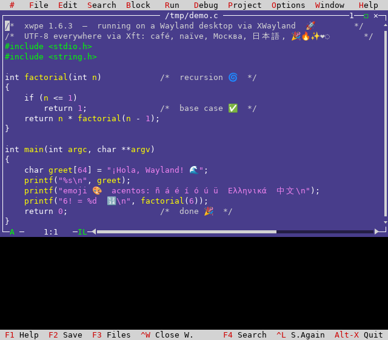
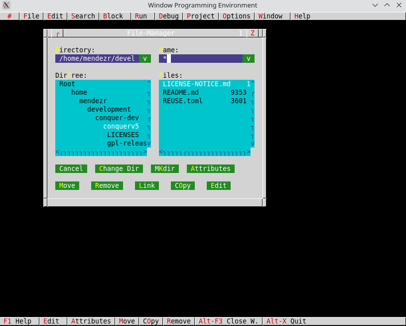
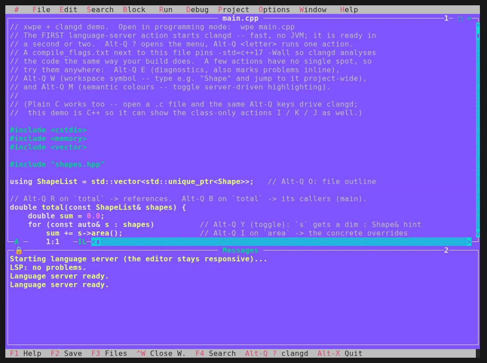
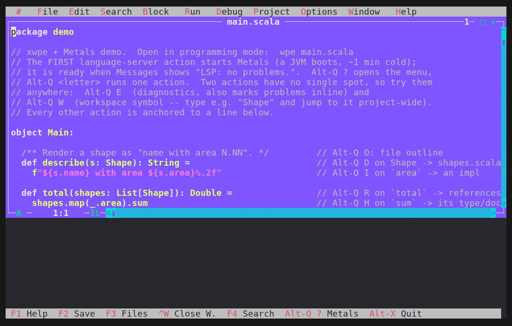
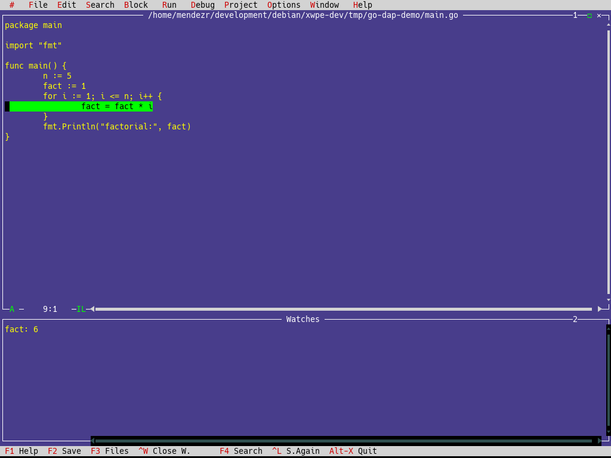
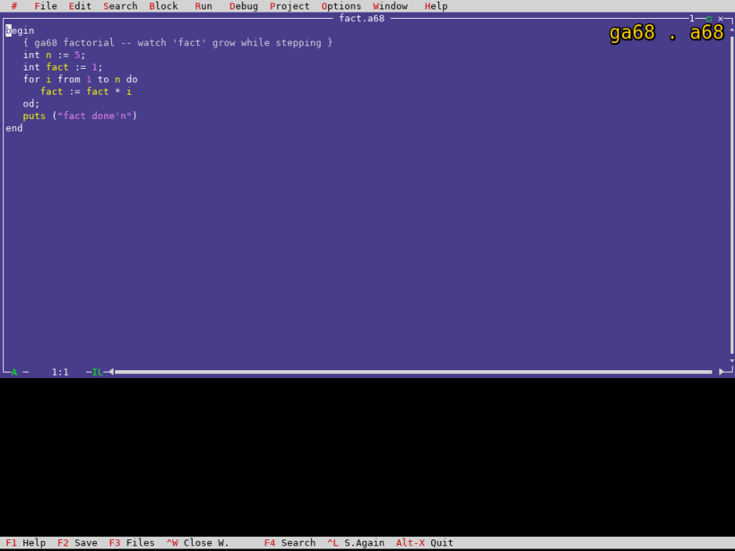

<p align="center">
  
</p>

# xwpe

> [!WARNING]
> **1.6.5 is in development &mdash; not yet tagged, experimental.** It is under
> heavy testing (no release candidate yet). The LSP client (language-server
> features) in particular is new and changing fast. Expect rough edges; please
> try it and report what breaks &mdash; **testers welcome.** For a stable build,
> use the latest tagged release (**1.6.4**) or the Debian package.

Xwpe is a programming editor and IDE for UNIX terminals and X11,
inspired by the Borland C and Pascal family. It provides syntax
highlighting, integrated compiler and debugger interface, project
management, and a function-key driven menu system. Emacs cursor keys
(Ctrl-P/N/F/B/A/E) are built in.

The **1.6.x series** brought xwpe from its 1993 origins to 2026:
UTF-8 terminal support, working compilers and debuggers for 12 languages,
a **Debug Adapter Protocol client** (the same protocol VS Code and Neovim
use) so modern debuggers plug straight in, mouse support, X11 fixes, and a
12-chapter Texinfo manual.

<p align="center">
  
</p>

<p align="center">
  
  <br><em>The same X11 build on a Wayland desktop, via XWayland &mdash; Xft color emoji and full UTF-8 (Cyrillic, CJK, Greek).</em>
</p>

<details><summary>Compare with xwpe 1.5 (2006)</summary>
<p align="center">
  
</p>
</details>

## Quick start

```sh
# Install dependencies (Debian/Ubuntu)
sudo apt install build-essential autoconf automake pkg-config texinfo \
  libncurses-dev libx11-dev libxft-dev libcairo2-dev libpango1.0-dev \
  libvterm-dev libjson-c-dev libgpm-dev zlib1g-dev librsvg2-bin

# Build and install
autoreconf -fi && ./configure && make && sudo make install

# Run
wpe file.c          # terminal mode
xwpe file.c         # X11 mode
```

That is the Debian/Ubuntu fast path. For a generic-Linux dependency list, the
**macOS** (Homebrew) build, the optional `configure` flags, and what
`make install` provides, see [**Building & installing**](#building--installing)
below. (`make install` is what enables full syntax highlighting and the in-app
Help -- skip it and only C/C++ highlight.)

## What's new in 1.6.5 (in development, not yet tagged)

xwpe plugs into the modern toolchain through the same standard protocols other
editors use &mdash; a real source-level debugger (DAP) and IDE navigation (LSP)
&mdash; while staying a few-megabyte terminal program: the discoverable Borland
UX, mouse and all, zero per-project config, and no X server or heavy GUI runtime
to install.  It runs the same over SSH, on a plain console, or in any terminal
emulator.

* **Debug Adapter Protocol (DAP) client &mdash; modern debuggers, no bespoke
  backend.** xwpe now speaks DAP, the wire protocol behind VS Code, Neovim
  and Emacs debugging.  Three languages are wired: **Go via Delve** (`dlv dap`),
  **Rust via gdb** (`gdb --interpreter=dap` &mdash; gdb is a first-class Rust
  debugger), and **Scala via Bloop** (the Scala Center `scala-debug-adapter`,
  reached through `scala-cli`).  Open a `.go`, `.rs` or `.scala` file, set a
  breakpoint, and Ctrl-G R drives a real source-level debug session &mdash;
  Run/Continue (Ctrl-G R), Step Over (F8), Step Into (F7), live watches
  (Ctrl-G W), and program output in Messages, the same keys you already use for
  gdb.  This is xwpe's seventh debugger backend (`DEB_DAP`), selected
  automatically by extension; the six text backends (gdb, jdb, pdb, a68g, sdb,
  dbx) are untouched.

  The engine carries **three transports** behind one API, because each adapter
  dictates its own &mdash; reverse-TCP (Delve is a server; program output read
  from a pty), stdio (gdb/lldb speak DAP on their own pipes; output via DAP
  events), and TCP-client (connect to an endpoint a build server already
  started, as for Scala/Bloop).  The JVM has no standalone DAP server, so xwpe
  runs a short Build Server Protocol handshake against `scala-cli`/Bloop to get
  one &mdash; no Scala artifact ships in xwpe, the toolchain stays external.
  Adding a language is a one-row descriptor; `lldb-dap` for C/C++ is next.

* **Language Server Protocol (LSP) client &mdash; an IDE, not just a debugger.**
  Where DAP lets xwpe *run* your code, LSP lets it *understand* it: xwpe speaks
  LSP to the same servers VS Code / Neovim / Emacs use. **Scala via Metals** is
  wired &mdash; open a `.scala` file and the **Alt-Q** prefix gives the IDE
  staples: **E** diagnostics (compiler errors in Messages, live as you type),
  **D** definition, **I** implementation, **T** type-definition, **H** hover
  (type + docs), **C** completion, **R** references, **O** file outline, **W**
  project-wide symbol search, **A** code actions / quick-fixes, **S** signature
  help, **N** rename, **F** format (scalafmt, whole-file or just the marked
  range), **B**/**G** call hierarchy (incoming / outgoing), **K**/**J** type
  hierarchy (super / sub), **V** expand selection by syntax, **U** highlight
  every use, **L** code lenses, **Y** inlay hints (inferred types) and **M**
  semantic colours (compiler-driven highlighting). `Alt-Q ?` opens a menu of
  them all. **C and C++ are wired too, via [clangd](https://clangd.llvm.org/)**
  &mdash; the same keys, the same engine, no JVM and no
  build-server wait, so it is ready in seconds and `Alt-Q D` follows straight
  into the system headers (opened read-only). **Python is wired via
  [pyright](https://github.com/microsoft/pyright) or
  [pylsp](https://github.com/python-lsp/python-lsp-server)** &mdash; xwpe uses
  whichever is on `PATH` (prefers pyright, the VS Code engine; falls back to the
  Debian-native `python3-pylsp`). **Go**
  ([gopls](https://pkg.go.dev/golang.org/x/tools/gopls)) and **Rust**
  ([rust-analyzer](https://rust-analyzer.github.io/)) are wired too. The engine (`we_lsp.c`) reuses the DAP JSON-RPC framing (no new
  dependency) and is integration-tested against a real Metals, clangd, Python
  server, gopls *and* rust-analyzer &mdash; **five languages, one engine**; adding
  a server is a one-row descriptor, not new plumbing.

  **Try it in your language.** Each has a small, fully-commented demo project
  that exercises every `Alt-Q` action in that language's own idioms &mdash; open
  it and read down the code &mdash; plus a **captioned tour GIF** that walks the
  breadth of LSP (hover, inlay hints, highlight-all-uses, references, outline)
  and ends on a **rename refactor with Undo**:

  | Demo (open with `wpe`) | Language | Server | Tour |
  |---|---|---|---|
  | [`docs/examples/scala-lsp/`](docs/examples/scala-lsp/)   | Scala  | Metals          | [tour](docs/demos/gifs/scala/tour.gif) |
  | [`docs/examples/c-lsp/`](docs/examples/c-lsp/)           | C/C++  | clangd          | [tour](docs/demos/gifs/c/tour.gif) |
  | [`docs/examples/python-lsp/`](docs/examples/python-lsp/) | Python | pyright / pylsp | [tour](docs/demos/gifs/python/tour.gif) |
  | [`docs/examples/go-lsp/`](docs/examples/go-lsp/)         | Go     | gopls           | [tour](docs/demos/gifs/go/tour.gif) |
  | [`docs/examples/rust-lsp/`](docs/examples/rust-lsp/)     | Rust   | rust-analyzer   | [tour](docs/demos/gifs/rust/tour.gif) |

  Install each server from [**Building & installing**](#building--installing)
  (Debian and macOS). One Metals caveat worth knowing: it needs an **LTS JDK (17
  or 21)** in `JAVA_HOME` &mdash; its presentation compiler (hover, completion,
  go-to-definition) runs there, and a too-new JDK (e.g. OpenJDK 26) crashes it
  (`asTerm called on not-a-Term`) so hover/navigation silently return empty.
  (`//> using jvm temurin:21` in `project.scala` pins only the *build* JVM, not
  Metals' own.) See
  **[`docs/LSP.md`](docs/LSP.md)** for the feature guide (every `Alt-Q` action,
  with clips), or the **Language servers** chapter of the manual (`info xwpe`,
  or Help&nbsp;&rarr;&nbsp;Info) for the full reference.

  <p align="center">
    
    <br><em>One tour, the breadth of LSP &mdash; hover, inlay hints, highlight-all-uses, references, outline, and a <strong>rename refactor with Undo</strong> &mdash; here in C via clangd. Every wired language has its own captioned tour: <a href="docs/demos/gifs/scala/tour.gif">Scala</a> &middot; <a href="docs/demos/gifs/python/tour.gif">Python</a> &middot; <a href="docs/demos/gifs/go/tour.gif">Go</a> &middot; <a href="docs/demos/gifs/rust/tour.gif">Rust</a> &middot; <a href="docs/demos/gifs/c/tour.gif">C/C++</a>.</em>
  </p>

  <p align="center">
    
    <br><em>And it stays discoverable: <code>Alt-Q ?</code> unfolds the full action menu, every command with its accelerator. More clips in <a href="docs/demos/">docs/demos/</a>.</em>
  </p>

  <p align="center">
    
    <br><em>Debugging Go through Delve/DAP: stopped at a breakpoint, with a live watch (<code>fact</code>) updating as the loop runs.</em>
  </p>

  It "just works" the way a Borland IDE should: program output (not the
  adapter's own chatter) appears in Messages; stepping off the end of `main`
  cleanly reports <em>Program exited</em> instead of wandering into the Go
  runtime; and Go always uses Delve, never gdb (which is unreliable for Go's
  goroutine runtime).  Requires `dlv` and `go`, plus a `go.mod` in the source
  directory (Delve builds the package).  Needs the new `libjson-c-dev` build
  dependency.

* **GNU Algol 68 (ga68)** joins the classic `a68g` interpreter: native compile
  + gdb source-level debugging, with both stropping dialects highlighted.

<details>
<summary><strong>Earlier releases &mdash; what was new in 1.6.3 and 1.6.2</strong> (click to expand; see <code>CHANGELOG</code> for the full history)</summary>

### What's new in 1.6.3

* **No more scrollbar bleed with overlapping windows** (X11): with three
  windows stacked so one is covered by two others at once, a covered
  window's scrollbar no longer shows through.  The fluid-scrollbar chrome
  now clips each window to its true visible region with cairo_region_t set
  algebra and indexes windows by z-level, matching the cell compositor.
* **Debugger memory leak fixed** (the 24-year "location unknown" leak):
  each window's breakpoint-line and syntax-state arrays were freed with
  neither at window close; both are now released.  Verified with a full
  valgrind sweep over gdb, pdb and jdb -- 0 bytes definitely lost.
* **Event-driven interactive debugging**: when the debugged program
  blocks on fgets/scanf, type input directly in the Messages window.
  Architecture: poll()-based fd multiplexing of X11 + gdb pipe + pty
  (same pattern as st, cgdb, foot terminals).  Backspace works.
* **Dead key compose**: accented characters (e, n, u, a, etc.) via
  dead keys in the editor, debug console, and dialog text fields.
  Fallback compose table when XIM does not compose natively.
* **UTF-8 in dialog fields**: Search, Replace, Compiler Options and
  all other dialogs accept and render accented characters correctly.
  UTF-8-aware cursor movement, backspace, and delete.
* **Runs on Wayland** via XWayland (verified under a headless KWin
  session, see the screenshot above).  xwpe is a plain Xlib app, so
  Debian's GNOME/KDE Wayland sessions run it through XWayland with no
  changes.  A native `wl_surface` backend is on the roadmap for 1.7.
* printf without \n visible after each step (fflush via gdb)
* Perl and COBOL compiler support (perl -c, cobc)
* Cursor-relative error navigation with wrap-around (Alt-T/Alt-V)
* Dialog usability: Tab/Shift-Tab navigation, radio buttons, colors
* **Borland-faithful popups**: message and dialog boxes drop the (inert)
  maximize box -- Borland popups never had one -- and keep a single working
  close box; click [X] to dismiss, exactly like Esc
* **Per-menu test coverage** for every menu section in both front-ends
  (pyte for `wpe`, headless Xft for `xwpe`), plus the contextual status bar
* **ncurses mouse drag**: window move/resize via title bar and borders
  (xterm mode 1002, same protocol as Midnight Commander)
* **Full mouse on the bare Linux console (GPM)**: pointer, click, window
  drag and resize with no X -- the GPM connection is pumped through the
  event loop (regression fixed)
* **Borland "User Screen" (Alt-F5)** restored on the console: leave the
  editor and see a program's own full screen (ANSI colour, cursor
  positioning, a TUI) verbatim -- what the Messages window cannot show.
  Try it with `tests/inputs/paint.c` (F9, Ctrl-F9, then Alt-F5).
* **Dialog resize safety**: survives extreme terminal shrink without
  crash; dialog clipped and restored cleanly on grow
* **Icon set**: two-tier SVG icon, .desktop entry, _NET_WM_ICON for
  window manager title bar and taskbar
* Modernized color palette for dialogs and syntax highlighting
* **Emoji in terminal mode**: ncurses rendering of emoji codepoints
  (U+1F389 etc.) in editor and Messages. Works in kitty, gnome-terminal.
* **Ctrl-F9 Run via pty**: interactive program I/O in Messages window,
  no xterm dependency, no screen switching
* **kitty mouse fix**: compatible mouse tracking without SGR conflicts

### What was new in 1.6.2

* **Xft font rendering in X11**: anti-aliased TrueType fonts with
  fontconfig fallback. Color emoji via Noto Color Emoji (libXft 2.3.5+
  BGRA). Replaces the 1993 XDrawImageString bitmap rendering.
* **Pixmap double-buffering**: zero flicker on resize and repaints.
* **Full UTF-8 in X11**: accents, Cyrillic, CJK, and emoji with
  CELL_WIDE support (cursor, delete, select all work correctly on
  wide characters).
* 12 compilers: gcc, g++, gfortran, fpc, javac, python3, pdflatex, perl, cobc, a68g, go, rustc
* 5 debuggers: gdb, jdb (Java), pdb (Python), a68g (Algol 68), and a DAP
  client (Go via Delve, Rust via gdb) -- all with F8 stepping and live watches
* Program output in Messages buffer (Ctrl-G P) -- no terminal switching
* Mouse in terminal emulators (xterm protocol) and Linux console (GPM)
* 33-year-old Redo crash fixed, 30-year-old pipe leak fixed
* Automated tests: pyte (wpe/ncurses) + headless X11 GUI suite (xwpe/Xft)

See `CHANGELOG` for full details.

</details>

## Compiler support

| Compiler | Language | F9 | Error nav | Extensions |
|----------|----------|:--:|:---------:|------------|
| gcc      | C        | ok | ok | `.c` |
| g++      | C++      | ok | ok | `.cpp` `.cc` `.C` `.cxx` |
| gfortran | Fortran  | ok | ok | `.f` `.f90` `.f95` `.f03` `.f08` |
| fpc      | Pascal   | ok | ok | `.p` `.pas` `.pp` |
| javac    | Java     | ok | ok | `.java` |
| python3  | Python   | ok | ok | `.py` |
| pdflatex | LaTeX    | ok | ok | `.tex` |
| perl     | Perl     | ok | ok | `.pl` `.pm` |
| cobc     | COBOL    | ok | ok | `.cob` `.cbl` |
| a68g     | Algol 68 | ok | line | `.a68` `.alg` |
| go       | Go       | ok | ok | `.go` |
| rustc    | Rust     | ok | ok | `.rs` |

Any compiler that emits `file:line:column: message` diagnostics (clang,
rustc, go build, dmd, ghc, nim, ...) works with the default GNU pattern.
Custom formats are configurable via Options -> Programming using xwpe's
pattern language (`${FILE}`, `${LINE}`, `${COLUMN}`, wildcards).

## Debugger support

| Debugger | Language | Start | Step | Output | Auto-select |
|----------|----------|:-----:|:----:|:------:|-------------|
| gdb      | C/C++/Fortran/Pascal | Ctrl-G R | F8 | Ctrl-G P | `.c` `.cpp` `.f90` `.p` |
| jdb      | Java     | Ctrl-G R | F8 | Ctrl-G P | `.java` |
| pdb      | Python   | Ctrl-G R | F8 | Ctrl-G P | `.py` |
| a68g     | Algol 68 | Ctrl-G R | F8 | Ctrl-G P | `.a68` `.alg` |
| DAP (Delve) | Go   | Ctrl-G R | F8/F7 | Messages | `.go` |
| DAP (gdb)   | Rust | Ctrl-G R | F8/F7 | Messages | `.rs` |

The Go and Rust rows use the Debug Adapter Protocol -- the same wire protocol
VS Code, Neovim and Emacs DAP use -- so the debugger is a standard adapter
(`dlv dap` for Go; `gdb --interpreter=dap` or `lldb-dap` for Rust) rather than a
bespoke backend.  Go needs `dlv` + `go` and a `go.mod`; Rust needs `rustc` and
either `gdb` (default) or `lldb-dap` (used automatically where gdb is absent,
e.g. macOS; force it with `XWPE_DAP_ADAPTER=lldb`).  Scala (Metals) and C/C++
are planned on the same engine.

<p align="center">
  
  <br><em>ga68 + gdb: stepping a factorial with a live watch (<code>fact</code>: 1 &rarr; 2 &rarr; 6 &rarr; 24 &rarr; 120).</em>
</p>

Algol 68 has two toolchains, and xwpe debugs each `.a68`/`.alg` file with the
one that matches its dialect (detected from the file's content): **a68g** (the
Algol 68 Genie interpreter) with its `--monitor`, or **ga68** (the GCC Algol 68
front-end) with **gdb** on the compiled native binary, breaking at
`__algol68_main` instead of `main`.

a68g uses its built-in `--monitor` (a full gdb-class source-level debugger):
breakpoints, run/continue from a68g's automatic break at line 1, F8 step
(line-granular over interruptable units), watches (`evaluate EXPR`), and a
call stack -- the same Borland keys as the other backends.

Program output is captured in the Messages buffer (same window as
compiler errors). Ctrl-G P shows output with full scroll at any time.

## Building & installing

**One command (Debian/Ubuntu or macOS):**

```sh
sh contrib/setup.sh             # deps -> build -> install -> wire your shell
sh contrib/setup.sh --dry-run   # ...or print exactly what it will run, first
```

It installs the build dependencies (apt or brew), builds and installs xwpe, and
adds the environment helper to your shell profile. It does **not** install the
optional language servers -- pick those in step 2. Re-open your terminal when it
finishes. (It is a short, readable POSIX script:
[`contrib/setup.sh`](contrib/setup.sh).)

**Or do it by hand** -- the same four steps, each detailed below:

1. **Build** xwpe for your OS -- [Build xwpe](#build-xwpe).
2. **Install** the compilers / language servers you want -- [External tools it
   drives](#external-tools-it-drives).
3. **Wire your shell** so xwpe finds them -- `sh contrib/xwpe-env --persist`
   (one command, any shell); see [Environment setup](#environment-setup).
   **Skip this and the `Alt-Q` LSP features report "server not found"** even
   though you installed them.
4. **Run** a demo -- `wpe docs/examples/c-lsp/main.cpp`; see
   [Run a bundled demo](#run-a-bundled-demo).

For a plain editor, step 1 alone is enough; steps 2-4 add the
compiler/debugger/LSP layer.

`make install` is part of the normal build, not an afterthought: it installs
`syntax_def` (the syntax-highlighting rules), the in-app help, the option file
and the man page. **Skip it and you get only the built-in C/C++ highlighting and
no Help.** To run straight from the build directory without installing, point
`XWPE_LIB` at it -- xwpe then loads its data files from there:

```sh
XWPE_LIB="$(pwd)" ./wpe foo.c       # syntax_def + help + options from the build dir
```

(`XWPE_LIB` overrides the compiled-in install path; export it to make it
permanent -- or let `contrib/xwpe-env` set it, see
[Environment setup](#environment-setup). A `~/.xwpe/syntax_def` copy also works,
but only for highlighting.)

### Build xwpe

xwpe needs a C compiler, autotools and pkg-config, plus **ncursesw** (required),
**libvterm** and **json-c**. **X11 + Xft + Cairo + Pango** are optional -- only
the graphical `xwpe` uses them; the terminal `wpe` builds without them
(`--without-x`). **GPM** is optional (Linux-console mouse; not on macOS).

#### Debian / Ubuntu

```sh
sudo apt install build-essential autoconf automake pkg-config texinfo \
  libncurses-dev libx11-dev libxft-dev libcairo2-dev libpango1.0-dev \
  libvterm-dev libjson-c-dev libgpm-dev zlib1g-dev librsvg2-bin
autoreconf -fi && ./configure && make && sudo make install
```

The X11 libraries enable `xwpe`'s anti-aliased Xft/Cairo rendering; for a
console-only build drop them and pass `--without-x` (only `libncurses-dev` plus
the build tools are then required). `texinfo` builds the `info xwpe` manual.
That is a complete editor; for the `Alt-Q` IDE layer continue with steps 2-3 of
the Quick path (install the servers, then `source contrib/xwpe-env`).

#### Other Linux (any distribution)

Install the equivalent packages from the list above, then:

```sh
autoreconf -fi   # only from a git checkout
./configure      # --without-x = terminal-only;  --without-gpm = no GPM mouse
make
sudo make install
```

For the IDE features, continue with Quick-path steps 2-3 (servers, then
`source contrib/xwpe-env`).

#### macOS (Homebrew)

> **Untested on macOS** -- written to be portable, but no clean build is
> confirmed yet; please [open an issue](https://codeberg.org/mendezr/xwpe/issues)
> with results. `wpe` runs natively in a terminal (no XQuartz); the graphical
> `xwpe` needs XQuartz and looks much the same this release.

Build with Homebrew's keg-only `ncurses` (the `PKG_CONFIG_PATH` line points
`configure` at it), and install to a user-writable prefix so `make install`
needs no sudo:

```sh
brew install autoconf automake pkg-config ncurses libvterm json-c texinfo
export PKG_CONFIG_PATH="$(brew --prefix ncurses)/lib/pkgconfig:$PKG_CONFIG_PATH"
autoreconf -fi
./configure --without-x --without-gpm --prefix="$HOME/.local"
make && make install
export PATH="$HOME/.local/bin:$PATH"      # add to ~/.zshrc to keep it
wpe foo.c                                 # syntax_def + Help come from the install
```

That is a complete editor. For the `Alt-Q` IDE features, continue with Quick-path
steps 2-3: install the servers ([External tools](#external-tools-it-drives)) and
`source contrib/xwpe-env` (fish: `sh contrib/xwpe-env --shell fish | source`),
which is what puts Metals/clangd on `PATH` and sets `JAVA_HOME`.

Using **fish**? The two `export` lines above are bash/zsh; the fish equivalents
are `set -x PKG_CONFIG_PATH (brew --prefix ncurses)/lib/pkgconfig $PKG_CONFIG_PATH`
and `fish_add_path ~/.local/bin`. (The runtime variables -- `XWPE_LIB`,
`JAVA_HOME`, server `PATH` -- are handled per-shell by `contrib/xwpe-env`, see
[Environment setup](#environment-setup).)

- **The Meta key on a Mac is Option, not Command -- and you must enable it.**
  xwpe's Alt-menus and the whole `Alt-Q` LSP layer need a key that sends a
  Meta/`Esc` prefix. macOS reserves **Command (Cmd)** for the terminal and the
  system, so Cmd-X / Cmd-R / Cmd-E act on
  [kitty](https://sw.kovidgoyal.net/kitty/) / [iTerm2](https://iterm2.com/) and
  never reach xwpe -- **Command is never Alt.** The Alt key is **Option (Opt)**,
  but every Mac terminal defaults to using Option to type accented characters, so
  you must switch it to Meta first:
    - **kitty:** add `macos_option_as_alt yes` to `~/.config/kitty/kitty.conf`
      (kitty does NOT do this by default), then **fully quit and reopen kitty**
      (Cmd-Q) -- a config *reload* does not always apply this macOS setting.
    - **iTerm2:** Profiles -> Keys -> *Left Option key* -> *Esc+*.
    - **Terminal.app:** Settings -> Profiles -> Keyboard -> *"Use Option as Meta
      key"*. Its dated terminfo also causes ncurses key/colour quirks, so prefer
      kitty or iTerm2. Keep `TERM=xterm-256color` everywhere.

  **Verify it before launching xwpe:** run `cat -v`, press **Option-X** -- it must
  print `^[x`. If it prints an accented glyph instead, Option is still a compose
  key (the setting did not take -- check the file and that you fully restarted).
  `Esc` alone prints `^[`; `Cmd-X` prints `^[[...u` (kitty's own protocol, which
  xwpe cannot use -- that is why Command is never Alt). Once `cat -v` shows `^[x`,
  drive xwpe with **Option** (Opt-Q, Opt-X, ...), exactly like Linux Alt.
- **Function keys (F8/F9...) are grabbed by macOS.** By default the top-row keys
  are Mission Control / brightness / volume, so xwpe never sees `F9` (build) or
  `F8` (step). Either tick *System Settings -> Keyboard -> "Use F1, F2, etc. keys
  as standard function keys"* (then press the **fn** key for the media actions),
  or just use the equivalents that do not rely on the top row: `Alt-M` (Make),
  `Alt-C` (Compile), and the `Ctrl-G` debug prefix -- `Ctrl-G S` steps (= F8),
  `Ctrl-G R` runs/continues, `Ctrl-G P` shows program output. Verify a key
  reaches the terminal the same way as above: `cat -v`, press `F9`, it should
  print `^[[20~` (not switch a Space or dim the screen).
- **The prefix matters.** `--prefix="$HOME/.local"` keeps the whole install
  (`wpe`, `syntax_def`, the Help files, the man page) under your home directory,
  no sudo. For a system-wide install use `sudo make install` (default prefix
  `/usr/local`; on Apple Silicon that directory must already exist and be
  writable). A bare `make install` with neither a prefix nor sudo fails with
  `gmkdir: cannot create directory '/usr/local/share': Permission denied` -- so
  pick one of the two.
- **Or skip installing entirely:** `XWPE_LIB="$(pwd)" ./wpe foo.c` (or `source
  contrib/xwpe-env`) runs straight from the build tree with full syntax + Help.
- **GPM is Linux-only** (`--without-gpm`); the mouse still works through the
  terminal emulator.

### External tools it drives

xwpe auto-detects the compiler, debugger and language server by file extension
and runs whatever is on `PATH` -- install only the ones for the languages you
use. (`JAVA_HOME` for Metals is covered in [Environment setup](#environment-setup).)

#### Debian / Ubuntu

```sh
# compilers (F9 build + error navigation)
sudo apt install gcc g++ gfortran      # C/C++/Fortran
sudo apt install fpc                   # Free Pascal
sudo apt install default-jdk           # Java (javac + jdb)
sudo apt install python3               # Python (py_compile + pdb)
sudo apt install texlive-latex-base    # LaTeX (pdflatex)
sudo apt install perl                  # Perl (perl -c)
sudo apt install gnucobol              # COBOL (cobc)
sudo apt install algol68g              # Algol 68 (a68g + its monitor debugger)
sudo apt install golang-go             # Go (compile)
sudo apt install rustc                 # Rust (rustc -g)
sudo apt install gdb                   # C/C++/Fortran/Pascal/Rust debugger

# language servers (the Alt-Q LSP layer)
sudo apt install clangd gopls rust-analyzer python3-pylsp   # C/C++, Go, Rust, Python
cs install metals scala-cli                                 # Scala (coursier; get-coursier.io)
sudo apt install openjdk-21-jdk                             # Metals' JVM: an LTS JDK 17/21

# DAP debug servers not in the archive
go install github.com/go-delve/delve/cmd/dlv@latest         # Go (Delve)
```

#### macOS (Homebrew)

```sh
# compilers: clang ships with the Xcode Command Line Tools
# (xcode-select --install); add the others you need
brew install go rust gcc               # Go, Rust, gfortran (in gcc)

# language servers
brew install llvm gopls rust-analyzer pyright   # clangd lives inside llvm (keg-only)
brew install coursier openjdk@21 && coursier install metals scala-cli   # Scala/Metals + a JDK

# DAP debug servers
go install github.com/go-delve/delve/cmd/dlv@latest         # Go (Delve)
```

> **Metals needs an LTS JDK (17 or 21)** in `JAVA_HOME` -- its presentation
> compiler (hover, completion, go-to-definition) runs there, and a too-new JDK
> (e.g. OpenJDK 26) crashes it (`asTerm called on not-a-Term`) so
> hover/navigation silently return empty. Wiring `JAVA_HOME` is covered next.

### Environment setup

xwpe finds the language servers, the JDK and (for an uninstalled build) its data
files through a few variables. Rather than exporting them by hand, let the
bundled **`contrib/xwpe-env`** helper set them -- the `brew shellenv` idiom: it
emits shell code rather than a list you copy, finds clangd / the JDK / the
Coursier dir / this checkout, and skips whatever is absent. Plain POSIX `sh`, so
it works the same on macOS, Linux and the BSDs.

**Permanent (every new terminal) -- add it to your profile, once:**

```sh
sh contrib/xwpe-env --persist     # detects bash/zsh/fish, writes the line with
                                  # this script's ABSOLUTE path, idempotent
```

**Just this shell (no profile change):**

```sh
eval "$(sh contrib/xwpe-env)"                  # bash / zsh
sh contrib/xwpe-env --shell fish | source      # fish (it cannot eval POSIX export)
```

Then confirm: `echo $XWPE_LIB` is set and `command -v metals` finds the server.

> **Gotchas this avoids.** `eval`/`| source` change only the CURRENT shell --
> `--persist` is what makes it stick. And a hand-written profile line must use an
> ABSOLUTE path (`contrib/xwpe-env` is relative to the checkout); `--persist`
> writes the absolute path for you. Seeing
> `fish: Unknown command: contrib/xwpe-env`? You ran the bash/zsh line in fish.

The helper sets `XWPE_LIB` (so a non-installed build finds its data files) and,
for Metals, points `JAVA_HOME` at a 17/21 JDK -- on Linux it looks under
`/usr/lib/jvm`, on macOS it asks Homebrew / `java_home`. Metals' first start then
indexes for minutes before hover and navigation answer.

### Run a bundled demo

Each wired language has a small, fully-commented LSP demo. Open one **as `wpe`**,
then `Alt-Q E` starts the server and `Alt-Q ?` lists the actions; each
`docs/examples/*-lsp/` has its own walkthrough:

```sh
./wpe docs/examples/c-lsp/main.cpp        # clangd, ready in ~2s
./wpe docs/examples/rust-lsp/src/main.rs  # rust-analyzer
./wpe docs/examples/scala-lsp/main.scala  # Metals (slow first start)
```

### Terminal & console notes

**Any terminal emulator** (xterm, kitty, gnome-terminal, iTerm2, tmux): the
mouse -- pointer, click, window drag/resize -- works natively over the xterm
protocol, no extra setup. (On macOS, enable Option-as-Meta so the `Alt-` keys
reach xwpe; see the macOS build notes above.)

> **Multiplexers -- prefer `tmux` over GNU `screen`.** xwpe uses the modern SGR
> mouse protocol (`ESC[<...M`). `tmux` forwards it, so the mouse works inside a
> tmux session. GNU `screen` (depending on version/`TERM`) does **not** pass SGR
> mouse through, so clicks and drags arrive as raw bytes that get **typed into
> the editor** instead of moving the cursor. This is a `screen` limitation, not
> an xwpe bug -- the same xwpe works fine in the same terminal *outside* screen.
> Use `tmux`, or run xwpe directly without a multiplexer, if you need the mouse.
> (Keyboard-only use is unaffected in either.)

**Linux console (no X, Ctrl+Alt+F2):** bitmap fonts look tiny on HiDPI, and the
mouse needs the GPM daemon:

```sh
sudo apt install console-terminus
setfont Lat15-Terminus32x16            # readable on HiDPI
sudo apt install gpm                   # then: pointer, click, window drag/resize on a bare VT
```

With `gpm` running you get the full mouse on a bare VT, no X needed.

## Syntax highlighting

Ships with C, C++, Fortran, Pascal, Java, Python, LaTeX, Perl, COBOL. The rules
live in `syntax_def`, found via `sudo make install` or `XWPE_LIB` (see
[Building & installing](#building--installing)).

The format is documented in `docs/chapters/configuration.texi`. Adding
a language requires listing keywords, operators, and comment delimiters.

## Documentation

| Level | Access | Content |
|-------|--------|---------|
| **In-app help** | F1 | Menus, key bindings, basic usage |
| **Texinfo manual** | `info xwpe` (requires `info` package) | 13 chapters: editor, compiling, debugging, language servers, tutorials, reference |
| **Man pages** | `man xwpe` | Command-line options |
| **LSP / IDE guide** | [`docs/LSP.md`](docs/LSP.md) | The `Alt-Q` actions, per-language setup, read-only stdlib |
| **Try-it demos** | [`docs/examples/`](docs/examples/) | Runnable, commented testbeds (one per language) + compiler/debugger examples |
| **Demo GIFs** | [`docs/demos/`](docs/demos/) | Recorded feature clips and per-language tours |
| **For contributors** | [`HACKING.md`](HACKING.md), [`HACKING-LSP.md`](HACKING-LSP.md), [`HACKING-DAP.md`](HACKING-DAP.md) | Architecture of the editor, the LSP client, the DAP debugger |

## Known limitations

- **X11 clipboard**: internal buffers only. System clipboard
  (PRIMARY/CLIPBOARD) planned for v1.7.
- **Language server, one document at a time**: the LSP server attaches to a
  single open file; using an Alt-Q action in a different file transparently
  re-points it (a brief pause). Rename (Alt-Q N) applies to the current file
  only; edits it would make in other files are reported, not applied.
- **Dialog scrollbars**: window scrollbars use Unicode glyphs (1.6.3), but
  the scrollbars drawn inside dialogs are still ASCII. Cosmetic; planned for
  v1.7.

## Contributing

Issues, bug reports, and patches welcome on Codeberg:
https://codeberg.org/mendezr/xwpe

**We especially need testers.** xwpe was untested for nearly 20 years.
If you can try it -- any terminal, any compiler, any workflow -- open
an issue even if everything works.

See [tests/README.md](tests/README.md) for the automated test suite and the
full dependency list.  `tests/run-tests.sh` runs everything: the C unit tests,
the pyte (ncurses, `wpe`) suite, and the headless X11 GUI (`xwpe`) suite.  The
X11 step self-skips when its stack is absent (`xvfb matchbox-window-manager
xdotool x11-utils imagemagick python3-pil`); `--x11` runs just that layer.

## Project history

- **Fred Kruse** -- original author (1993, last release 1.4.2 ca. 1997)
- **Dennis Payne** -- continuation (1.5.x, 1997-2006), with
  contributions from ~25 developers (see CHANGELOG):
  https://www.identicalsoftware.com/xwpe/
- **Debian contributors** (Jari Aalto, Francesco P. Lovergine, Andreas
  Tille, et al.) -- patches now integrated upstream
- **Juan Manuel Mendez Rey** -- current maintainer (2026-),
  with Dennis Payne's blessing

Historical archive: https://codeberg.org/mendezr/xwpe-archives

## Architecture

For contributors and porters: see [HACKING.md](HACKING.md) for
internal architecture (SCREENCELL buffer model, double-buffer rendering,
popup save/restore, X11 extbyte system).

## Licence

GPL-2. See `COPYING`.
