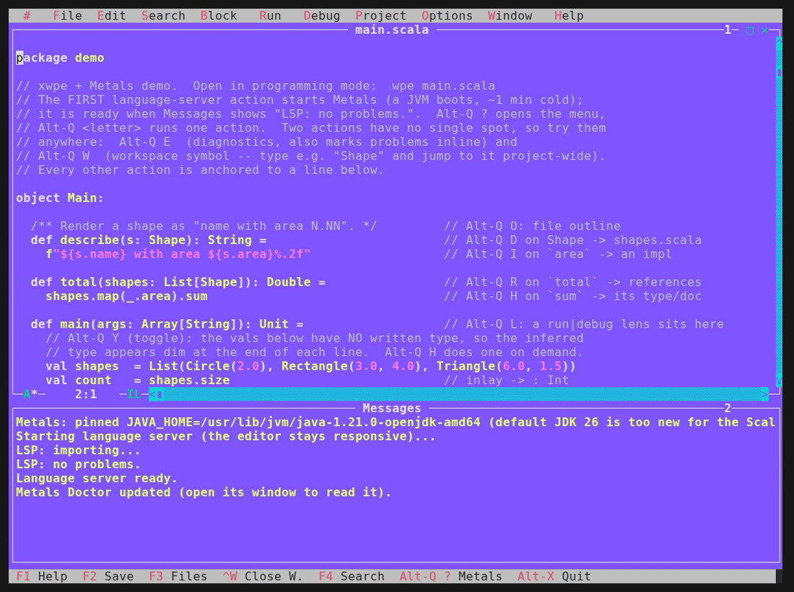
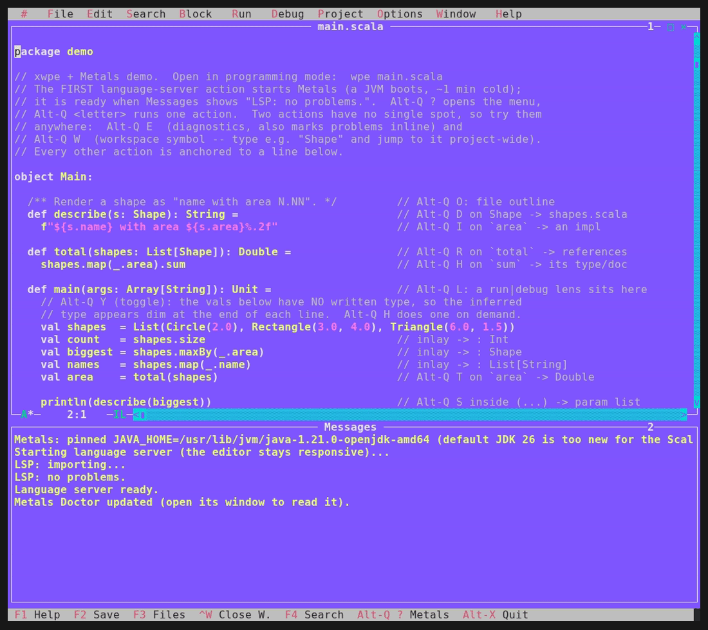
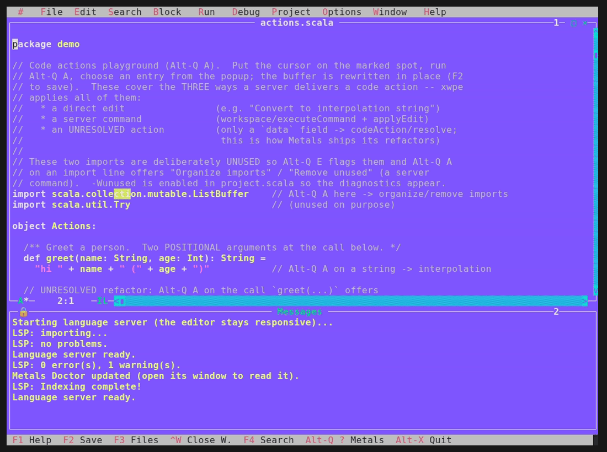

# xwpe LSP demos

Short terminal recordings of xwpe's Metals/LSP features, for the README, the
user-facing [`docs/LSP.md`](../LSP.md) guide and the tutorial chapter.  Each GIF
is generated from a `.tape` script with
[VHS](https://github.com/charmbracelet/vhs), so they are reproducible rather
than hand-captured (see *How these are made* below).

## Watch

### The Metals action menu (discoverable, Borland-style)
`Alt-Q ?` (or click `Metals` on the status bar) unfolds the full action list
upward from the bar -- every command with its `Alt-Q` accelerator.


### Go to definition
With the cursor on a `describe(...)` call, `Alt-Q D` leaps it up to the
`def describe` that defines it -- the iconic IDE jump, over LSP.



### Semantic colours (server-driven highlighting)
`Alt-Q M` repaints the file from Metals' semantic tokens: types, function
calls, parameters and variables get their own colours -- distinctions the
regex lexer cannot make.  Toggle it off to return to the classic colours.



### Code action + Undo/Redo
`Alt-Q A` on the positional call `greet("Ada", 42)` offers "Convert to named
arguments".  Metals ships that refactor *unresolved* (only a `data` field), so
xwpe does a `codeAction/resolve` round-trip to fetch the edit, then rewrites the
call to `greet(name = "Ada", age = 42)`.  The point of the clip: the server's
rewrite is an ordinary edit -- `Ctrl-U` undoes it, `Ctrl-R` redoes it.



## Per-language tours

One "tour" GIF per wired language, each walking its own testbed in
[`docs/examples/`](../examples/) through the headline actions -- hover,
references, outline, go-to-definition -- so a developer of that language sees the
IDE features in their *own* code.  They live next to their testbeds and are
embedded in each folder's `README.md`:

| Tour | Language | Server | Testbed |
|------|----------|--------|---------|
| `gifs/c/tour.gif`      | C/C++  | clangd        | [`examples/c-lsp/`](../examples/c-lsp/)           |
| `gifs/python/tour.gif` | Python | pyright/pylsp | [`examples/python-lsp/`](../examples/python-lsp/) |
| `gifs/go/tour.gif`     | Go     | gopls         | [`examples/go-lsp/`](../examples/go-lsp/)         |
| `gifs/rust/tour.gif`   | Rust   | rust-analyzer | [`examples/rust-lsp/`](../examples/rust-lsp/)     |

Each tour walks the **breadth** of LSP in that language -- diagnostics, hover,
inlay hints, document highlight (every use lights up), references, outline, and
a **rename refactor with Undo** as the finale (`total` -> `tally` across the
file, reversible with `Ctrl-U`) -- so it is much more than a lone go-to-definition.

Regenerate them with `docs/demos/record-tours.sh` (it records each against a
throwaway copy of the testbed, so the servers' caches never land in the repo):

```sh
docs/demos/record-tours.sh            # all four
docs/demos/record-tours.sh c          # just one
```

> **CRITICAL:** the recordings MUST run the binary as **`wpe`** (programming
> mode), never `we`.  `record-tours.sh` already defaults `WPE` to `./wpe`, so do
> NOT override it with `./we`.  The Alt-Q LSP prefix (and F9/Ctrl-G) lives in
> `e_prog_switch`, which is gated by `WpeIsProg()` -- under `we` the whole layer
> is silently off and the tours film a cursor moving over a dead editor.  See
> *Recording gotchas* below.

## How these are made

The GIFs are **reproducible**, not hand-captured.  Each one is a short
[VHS](https://github.com/charmbracelet/vhs) `.tape` script -- a little program
that types keys and waits -- which VHS plays back against a headless terminal
([`ttyd`](https://github.com/tsl0922/ttyd)) and renders to a GIF (encoded with
`ffmpeg`).  Because every keystroke is scripted, re-recording after a UI change
is one command and the clips never silently drift from how the editor actually
behaves.

The neat trick for the server-backed clips: the ~1-minute Metals cold start
(JVM boot, build import, first index) runs inside a `Hide` ... `Show` block, so
the recording *does* the real work but the GIF jumps straight to the action.
A tape reads like the demo itself -- here is the spine of `codeaction.tape`:

```
Hide                                  # everything until Show is run but not filmed
Type "cd ${DEMO} && ${WPE} actions.scala"
Enter
Alt+q                                 # Alt-Q E starts Metals (diagnostics)...
Type "e"
Enter
Sleep 95s                             # ...let it index, off-camera
Show                                  # filming starts here
Down@60ms 27                          # cursor down to the greet(...) call
Right@45ms 10
Alt+q                                 # Alt-Q A -> code-action popup
Type "a"
Down@350ms 3                          # select "Convert to named arguments"
Enter                                 # apply (codeAction/resolve + rewrite)
Ctrl+u                                # undo the server's rewrite
Ctrl+r                                # redo it
```

## Recording gotchas (read before re-recording)

- **Run as `wpe`, never `we`.** The binary is one executable; `argv[0]` picks
  the mode via `WpeIsProg()`.  `e_prog_switch` -- Alt-Q (LSP), F9 (compile),
  Ctrl-G (debug) -- only runs when invoked as `wpe`/`xwpe`.  As `we`, Alt-Q does
  nothing and the action letter is typed into the buffer.  The `record*.sh`
  scripts default `WPE=./wpe`; don't override it with `./we`.
- **VHS has no `End`/`Home` key.** To clear a prefilled dialog field (e.g. the
  rename "Rename to" box), use `Right 8` then `Backspace 8`, then type the new
  text.
- **Some actions move the cursor** (the inlay toggle is one).  A tour that ends
  on a cursor-sensitive action (rename, go-to-definition) re-establishes the
  cursor first with `Up 60` / `Down N` / `Right M` (top-of-file then the known
  offset) so the action targets the intended symbol.
- **Go-to-definition must be the last cursor action** if used: it is the only
  read action that moves the cursor off the symbol, so a cursor-sensitive action
  after it pops "No ... found".

## Debugging a recording (data, not frame-guessing)

If a recorded action "doesn't show", set `XWPE_UI_TRACE` to a file and read it
instead of eyeballing frames: each Alt-Q action appends what key it received and
whether its handler ran.

```sh
XWPE_UI_TRACE=/tmp/ui.txt WPE=./wpe DEMO=$ws vhs docs/demos/tapes/c/tour.tape
cat /tmp/ui.txt        # e.g. "e_lsp_ui_key c=104 'h'"  -> Alt-Q H dispatched
```

No trace lines at all == the action never reached the handler (almost always the
`we`-vs-`wpe` mistake above).

## Key captions (the keystroke overlay)

VHS cannot draw the pressed keys, so the captions are a reproducible
post-process: [`captions.sh`](captions.sh) burns a lower-third caption (the key
chord + what it does) onto a GIF, driven by a `.cue` file of `START DURATION
LABEL` lines.  All four tours share one cue ([`tours.cue`](tours.cue)) because
they share the tape body.

```sh
docs/demos/captions.sh docs/demos/gifs/c/tour.gif docs/demos/tours.cue
```

Retiming is editing numbers in the `.cue`, not re-recording.

## Regenerate

```sh
# from the repo root, with the editor built (make -> ./wpe) and tools on PATH.
# WPE MUST be ./wpe (programming mode); see "Recording gotchas".
WPE=./wpe DEMO=../scala-demo docs/demos/record.sh          # all tapes
WPE=./wpe DEMO=../scala-demo docs/demos/record.sh menu     # just one
```

`record.sh` lists its requirements (vhs, ttyd, ffmpeg; metals + scala-cli and
an indexed Scala workspace for the server-backed tapes).  The Metals tapes
`Hide` the ~1 min cold-start/indexing wait so the GIF jumps to the action.

## Tapes

| Tape | Shows | Needs Metals |
|------|-------|--------------|
| `tapes/menu.tape`       | the action menu / discoverability  | no  |
| `tapes/definition.tape` | go to definition (cursor jump)     | yes |
| `tapes/semantic.tape`   | semantic colours before/after      | yes |
| `tapes/codeaction.tape` | code action + Undo/Redo            | yes |

See `SCENARIOS.md` for the full key-sequence scripts of every headline
feature (the source material for additional tapes and the reel).
