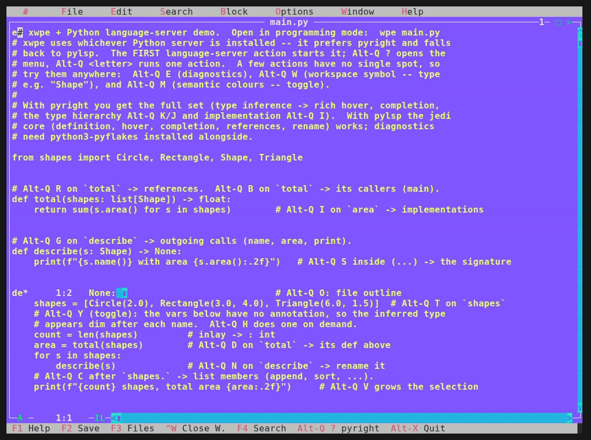

# Python (pyright / pylsp) language-server demo for xwpe

A tiny, deliberately-commented Python project that exercises the xwpe
language-server actions for Python.  xwpe uses whichever server is installed --
it **prefers pyright** (type inference) and **falls back to pylsp** (jedi).



*A tour on this testbed: hover, inlay hints, highlight-all-uses, references, the
file outline, and a rename refactor (`total` &rarr; `tally`) with Undo -- over the
Python server (pyright/pylsp).  The pressed keys are captioned along the bottom.*

## Requirements

One of:

```sh
pipx install pyright                       # preferred (full type inference)
# --- or the Debian-native fallback ---
sudo apt install python3-pylsp python3-pyflakes python3-rope
```

- **pyright** gives the full set: rich hover/completion, the type hierarchy
  (`Alt-Q K`/`J`), implementation (`Alt-Q I`), inlay hints (`Alt-Q Y`) and
  diagnostics out of the box.
- **pylsp** gives the jedi core -- definition, hover, completion, references,
  rename.  Diagnostics need `python3-pyflakes`; the `Alt-Q A` refactors need
  `python3-rope`; the type hierarchy / inlay hints are not provided.

See the user-facing guide [`docs/LSP.md`](../../LSP.md), or the **Language
servers** chapter of the manual (`info xwpe`), for the full setup notes.

## Run it

```sh
cd docs/examples/python-lsp
wpe main.py              # programming mode (xwpe in X11; wpe in a terminal)
```

`Alt-Q ?` opens the action menu, `Alt-Q <letter>` runs one directly.

## What to try

Each line in `main.py`, `shapes.py` and `actions.py` carries an inline comment
telling you which action to try right there.  For reference (the **pyright**
column; "pyright" in *Needs* marks actions pylsp/jedi does not provide):

| Key       | Action            | Where to try it                          | Needs   |
|-----------|-------------------|------------------------------------------|---------|
| `Alt-Q E` | Diagnostics       | anywhere (pylsp: + python3-pyflakes)      |         |
| `Alt-Q D` | Definition        | on `Circle` (main) or `pi` -> `math` stub |         |
| `Alt-Q I` | Implementation    | on `area` in `shapes.py` -> overrides     | pyright |
| `Alt-Q T` | Type              | on `shapes` in `main`                     |         |
| `Alt-Q H` | Hover             | on `area`, any identifier                 |         |
| `Alt-Q C` | Complete          | after `shapes.`                           |         |
| `Alt-Q R` | References        | on `Shape` / on `total`                   |         |
| `Alt-Q B` | Incoming calls    | on `total` in `main.py`                    | pyright |
| `Alt-Q G` | Outgoing calls    | on `describe` in `main.py`                 | pyright |
| `Alt-Q K` | Supertypes        | on `Circle` -> `Shape`                     | pyright |
| `Alt-Q J` | Subtypes          | on `Shape` -> Circle / Rectangle / Triangle | pyright |
| `Alt-Q U` | Uses (highlight)  | on `name` in `shapes.py`                   |         |
| `Alt-Q V` | Expand selection  | on a token in `main` (press again widens)  |         |
| `Alt-Q Y` | Inlay hints       | toggle: the un-annotated vars get `: T`    | pyright |
| `Alt-Q M` | Semantic colours  | toggle, anywhere                           |         |
| `Alt-Q O` | Outline           | any file                                   |         |
| `Alt-Q W` | Workspace symbol  | type `Shape` or `Circle`                   |         |
| `Alt-Q A` | code Actions      | `actions.py` -- see "Code actions" below   |         |
| `Alt-Q S` | Signature help    | inside `describe(...)` / `total(...)`      |         |
| `Alt-Q N` | reName            | on `describe` (or any symbol)              |         |
| `Alt-Q F` | Format            | the whole file (pylsp + black/autopep8)    | formatter |

`Alt-Q` opens the action menu; `Alt-Q <letter>` runs one directly.  To run the
program use `Ctrl-F9`, or debug with `Ctrl-G T` (pdb).

> **`Alt-Q L` (code lenses)** and **`Alt-Q F` (format) with pyright:** pyright is
> a type checker, not a formatter, and publishes no code lenses, so those two are
> empty under pyright -- install pylsp with a formatter plugin (black/autopep8)
> for formatting.  Not a bug.

## Go to definition into the standard library

`Alt-Q D` on `pi` (in `Circle.area`, `shapes.py`) jumps into the `math` type stub
that ships with the server (typeshed) -- which xwpe opens **read-only**, marked
by a padlock at the left of the title bar.  You can read and copy it, not edit.

## Code actions (Alt-Q A)

`actions.py` is a playground for the code actions, which are server-dependent
(see its header).  Put the cursor on a marked spot, run `Alt-Q A`, pick an entry;
the buffer is rewritten in place (`F2` saves; `Ctrl-U`/`Ctrl-R` undo/redo).

- **Organize Imports** (pyright) -- `Alt-Q A` on the unused `import os` / `sys`.
- **Extract variable** (pylsp + rope) -- `Alt-Q A` on `"hi " + who` in `greet`.
- **Extract method** (pylsp + rope) -- `Alt-Q A` on the body of `area_of`.
